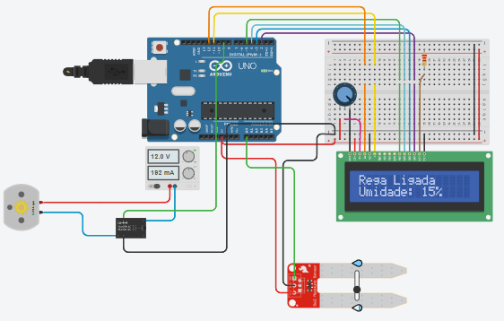

# Sistema Automático de Rega com Arduino

## Descrição do Projeto

Este projeto consiste em um sistema automático de rega para plantas, utilizando Arduino, sensor de umidade do solo, uma bomba d'água e uma interface LCD para exibir o status da rega. O sistema também permite controle manual via monitor serial.

---

## Componentes Utilizados

- Arduino Uno (ou similar)  
- Sensor de umidade do solo  
- Módulo relé para controle da bomba  
- Bomba d'água submersível ou similar  
- Display LCD 16x2 com controlador HD44780  
- Fonte de alimentação adequada  
- Cabos e protoboard  

---
Este programa usa C++

## Exemplo do Circuito

